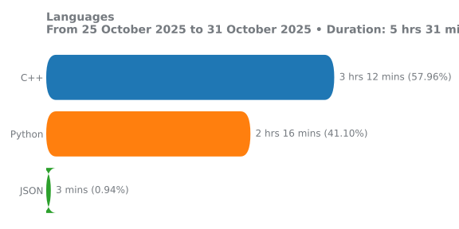
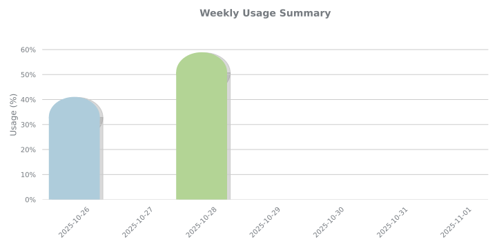
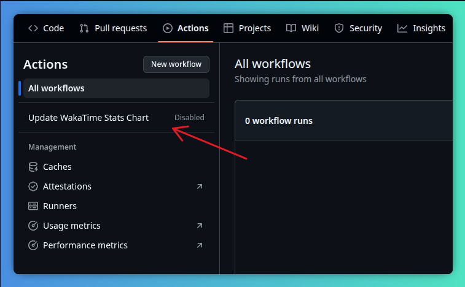
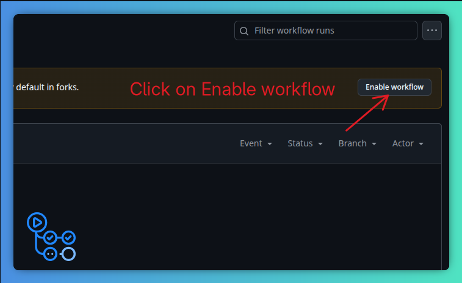
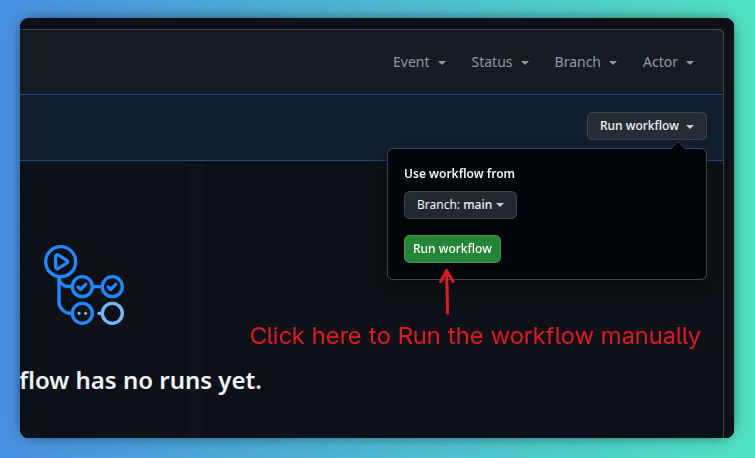

## WakaDash

Tool that fetches your weekly [WakaTime](https://wakatime.com/) coding statistics and generates charts. You can embed this visual breakdown anywhere - from your GitHub profile README to a personal portfolio.

## Language stats
<p align="center">
  
</p>

## Weekly stats
<p align="center">
  
</p>

## Badges
<p align="left">
  
</p>

<p align="left">
  
</p>

<br />


##  Use This in Your Own Profile

You can use WakaDash to show your own coding activity by just forking this repo and connecting your WakaTime account. Here's how:


### Step 1: Create a Waktime account 
Go to [WakaTime](https://wakatime.com/), create your account and get your API Key.

### Step 2:  Fork This Repo

Click the "Fork" button in the top right of this page and fork it to your account.

### Step 3: Add Your WakaTime API Key as a Secret
1. Go to your forked repo’s `Settings` → `Secrets and variables` → `Actions` → `New repository secret`

2. Name the secret exactly: **`WAKATIME_API_KEY`**

3. Paste your WakaTime API Key 

###  Step 4: Enable GitHub Actions
1. Go to the `Actions` tab in your forked repo

2. Enable workflows if prompted






4. The action will now run automatically once per day, and generate a new lang_stats.svg
or you can run it manually by clicking here.




### Step 5: Show It in Your GitHub Profile

In your Profile `Readme.md`, paste this:

Replace `<your-username>` with your user-name.

```md


```

 That's it! Every day your chart will auto-update with your latest WakaTime stats.

<br />

## Configuration

All stats are fully configurable by modifying the `config.json` file. Below are the customizable options:

### Wakatime stats range

`last_7_days`, `last_30_days`, `last_6_months`, `last_year`, or `all_time`

```json
"stats_range": "last_7_days",
```


### Badges 
Badges are powered by [Shields.io](https://shields.io/badges), so all customization options supported by Shields are available here.

#### Colors
You can customize the background color of the left and right parts of each badge using hex codes, RGB, RGBA, HSL, HSLA, or CSS named colors:

```json
"best_badge_right_color": "yellowgreen"
"best_badge_left_color": "grey"
"avg_badge_right_color": "tomato"
"avg_badge_left_color": "grey"
```

#### Badge style
Control the overall style of the badges.


```json
"badge_style": "flat-square"
```

Available styles:

* `flat`

<p align="left">
  
</p>

* `flat-square` (default)

<p align="left">
  
</p>

* `plastic`

<p align="left">
  
</p>


* `for-the-badge`

<p align="left">
  
</p>

* `social`

<p align="left">
  
</p>
